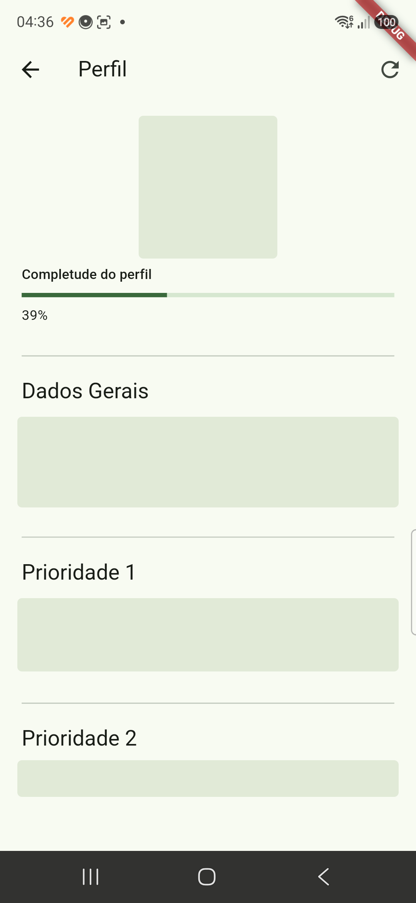

<p align="center">
  
</p>

# DiabAI and GlycoGuide

This repository contains two independent diabetes-support prototypes. They do not share an API, database, or runtime:

- **GlycoGuide** (`app/`) is a local FastAPI web application that stores CGM and self-reported data, optionally syncs LibreLinkUp, and uses Ollama for educational pattern discussion.
- **DiabAI** (`diabot/`) is an Android-focused Flutter application with a deterministic finite-state-machine (FSM) kernel. It logs events locally, accepts structured extraction from an optional on-device model, provides retrieval-only education answers, and supports on-device speech-to-text.

Neither application is a medical device. They do not diagnose conditions, calculate insulin doses, prescribe treatment, or replace an emergency plan or a qualified care team.

## Safety and data boundaries

Use this software only as an educational and logging aid. Follow your own clinical care plan and seek urgent professional help for an emergency.

Data handling differs by application:

- **GlycoGuide** keeps its SQLite database locally by default. It sends requests to the configured Ollama endpoint and, when enabled, sends LibreLinkUp credentials to Abbott to authenticate and retrieve shared data. The default Ollama endpoint is loopback, but a non-local `OLLAMA_BASE_URL` changes that boundary.
- **DiabAI** stores event logs and FSM audit records in local SQLite and keeps the onboarding profile in local preferences. Firebase/Google authentication is an external service. Its bundled RAG and speech models run on-device; its external Gemma 4 E4B `.litertlm` model (run via `flutter_gemma`) is loaded from device storage.

Health records and profiles are not encrypted at rest by DiabAI. GlycoGuide encrypts the saved LibreLinkUp password, but its local database still contains health data. Treat development devices accordingly.

## GlycoGuide web application

### Features

- LibreLinkUp synchronization and LibreView/LibreLink-style CSV import.
- Local SQLite storage for CGM readings, meals/carbohydrates, exercise, weight, insulin logs, profile data, and chat history.
- Stale-data check-ins for CGM review, meals, exercise, weight, and insulin.
- Ollama-backed educational discussion of recorded patterns with prompt-level medical guardrails.

### Requirements

- Python 3.10+
- [Ollama](https://ollama.com)
- A locally pulled Ollama model; the code defaults to `gemma3:4b`

### Run locally

```bash
python3 -m venv .venv
source .venv/bin/activate
pip install -r requirements.txt

ollama pull gemma3:4b
ollama serve

uvicorn app.main:app --reload --host 127.0.0.1 --port 8080
```

Open `http://127.0.0.1:8080`.

### Configuration

| Variable | Default | Meaning |
| --- | --- | --- |
| `OLLAMA_BASE_URL` | `http://localhost:11434` | Ollama API endpoint |
| `OLLAMA_MODEL` | `gemma3:4b` | Ollama model name |

### LibreLinkUp and CSV

LibreLinkUp synchronization is optional and needs an internet connection plus a LibreLinkUp account that has been invited to view the shared LibreLink data. It depends on an unofficial integration and may stop working if the upstream service changes.

CSV import is the alternative: export glucose history from LibreView, then import the file through the web UI. Disconnecting LibreLinkUp removes saved credentials but does not remove previously imported readings or other local logs.

GlycoGuide stores local data in `data/cgm_assistant.db`.

## DiabAI Flutter application

DiabAI is not a Flutter client for GlycoGuide. It is a separate Android-first prototype with its own authentication, local storage, and FSM kernel. It applies a single dark, violet-accented theme app-wide, and the same mark is reused as the Android launcher icon and as the small assistant avatar shown next to chat messages.

### Current capabilities

- Firebase Google/email authentication and a local profile collected through the FSM onboarding entry point.
- Typed input, quick replies, on-device speech-to-text, and a local chat UI.
- A deterministic FSM that handles glucose, meals, insulin, exercise, symptoms, illness, ketones, medication, CGM, profile, and question events.
- Missing-field collection, optional `when`/`where`/`what happened before` context, explicit event priority, event lifecycle tracking, and append-only FSM audit records.
- Composed emergency pre-emption using available signals, followed by resume of pending events. This is non-clinically-validated conversational guidance, not emergency dispatch or medical decision support.
- Local SQLite event logs and RAG retrieval for educational questions.

### Deliberate limits

- No insulin-dose calculation, treatment recommendation, emergency calling, live CGM feed, trend analysis, charts, CSV export, or cloud sync of health records.
- `cgm` and `profile` events are recognized but do not yet have complete collection workflows.
- The external Gemma model only extracts structured events. It does not generate the user-facing conversation. Without it, deterministic quick replies and bare numeric glucose entries still work; unconstrained free text is clarified instead.
- When the interpreter finds no matching event (`unknown`), its `free_reply` text is shaped by the **Nuno** persona (calm, objective, never alarmist or childish, explains when asked) — see [diabot/docs/fsm/nuno.mmd](diabot/docs/fsm/nuno.mmd). This only affects wording in that one free-text case; it never changes state, lifecycle, or gives medical guidance. DiabAI is the product name, Nuno is the conversational assistant.
- Free-text input first passes through a generic on-device semantic interpreter, which returns structured event candidates and fields for the deterministic Kernel. When an interpretation is ambiguous or below the confidence threshold, `Outras opções` opens the generic event menu without discarding a pending event, so the user can change topic or register another event.
- When a meal is identified, the deterministic Meal module first distinguishes food already consumed from a planned meal. Recorded meals collect stated carbohydrate grams and optional food details; planned meals collect intended foods and an optional user-provided carbohydrate estimate. It records context only and never calculates or recommends an insulin dose.
- DiabAI preserves its local profile, SQLite data, and authentication session across build updates. Debug builds expose a confirmed in-app action to erase local test data when a clean onboarding run is needed.

### Requirements

- Flutter and an Android SDK; Java 17 is required by the Android build.
- Android device or emulator.
- Valid Firebase Android configuration for authentication.
- Bundled assets for RAG and STT. They are intentionally not all committed to Git because model files are large.
- Optional free-text event extraction: a compatible Gemma 4 E4B `.litertlm` model copied to the device, normally `/sdcard/Download/gemma-4-E4B-it.litertlm`.

DiabAI does **not** require Ollama.

### Run and test

```bash
cd diabot
flutter pub get
flutter test test/orchestrator_test.dart
flutter test test/fsm_mermaid_contract_test.dart
flutter run
```

For the external model, copy the `.litertlm` file to the configured device path and grant DiabAI Android's **All files access** permission. After login, DiabAI loads the external model automatically before starting the chat or first-login onboarding; if either prerequisite is unavailable, it waits and offers a retry. RAG and speech models load only after the model is ready, sequentially.

### FSM kernel

The FSM, not the model, controls the flow:

```text
input -> deterministic shortcut or semantic extraction -> event stack
      -> emergency gate -> priority -> missing information
      -> optional context -> validation -> storage/audit -> next actions
```

Each event has an ID, source, lifecycle status, and audit trail. A completed event is stored; an invalid or unrecognized event is discarded with a reason; events that trigger emergency pre-emption are retained and resumed afterward. SQLite is accessed through the storage gateway rather than directly by the knowledge or priority engines.

On first login without a saved profile, the FSM enters `onboarding` only after the local model is ready. It gathers and saves the profile locally, then transitions to `idle`. Later logins detect the saved profile and enter `idle` directly.

The persisted Mermaid specifications live in [diabot/docs/fsm](diabot/docs/fsm). Each map contains a machine-readable contract checked against the Dart FSM declarations by `flutter test test/fsm_mermaid_contract_test.dart`. This verifies the declared states, event types, priority, lifecycle edges, and emergency contract, rather than attempting to infer arbitrary diagram layout.

The Time Engine is a separate DiabAI module that derives context from the current event stack and timestamped local history across 15-minute, 1-hour, 4-hour, 12-hour, and 24-hour windows. It supplies temporal facts to the Emergency Engine; temporal Priority and Knowledge rules must first be specified in Mermaid before implementation.

The Profile Engine is a separate passive context module. It incrementally records explicitly stated profile facts from normal conversation, plus available authenticated identity data such as name, email, and profile-photo URL, as a local SQLite snapshot with fact-level confidence and a completeness score. It never creates a global state, runs a questionnaire, asks profile questions, makes medical reasoning, or produces recommendations. Missing profile information is only exposed to the Knowledge Engine as context.

### Profile View

The DiabAI Profile View is a known-only projection of that local context. It places identity and the weighted completeness indicator at the top, shows name, e-mail, and general measurements in `Dados Gerais`, then presents available health facts in ascending `Prioridade` sections. Unknown fields are never rendered, and moving a fact into `Dados Gerais` does not alter its clinical completeness weight.

An authenticated photo is shown when available. The user may alternatively select a local avatar from the camera or gallery; the selected file remains on the device and is only stored as a local profile reference. This is the only interaction in the view: it does not collect health facts or turn the screen into a profile questionnaire.



The screenshot was captured during device validation and anonymized before inclusion: identity and health values are redacted while the rendered hierarchy remains visible.

### FSM evolution

The current kernel is designed to grow by modular event behavior without a new architectural redesign. Its global FSM, event lifecycle, emergency, priority, and knowledge engines remain separate. Begin each behavior change with complete Mermaid diagrams and the matching contract; then assess lifecycle, emergency, priority, and knowledge impact, add tests, and only then implement Dart.

Do not create event-specific global states such as meal or glucose states. Classify a feature as a new `EventType`, `FieldSpec`, `EmergencyEngine` rule, `PriorityEngine` rule, or `KnowledgeEngine`-only change. Change global states, the lifecycle diagram, or the emergency diagram only when that classification requires it. The full agent workflow is in [AGENTS.md](AGENTS.md).

For an implementation handoff, run `cd diabot && docs/create_fsm_handoff_zip.sh`. It produces [diabot/docs/zip/diabai-fsm-handoff.zip](diabot/docs/zip/diabai-fsm-handoff.zip) with the diagrams, implementation references, and tests required to understand and verify the FSM.

## Repository layout

```text
app/                 GlycoGuide FastAPI application
data/                GlycoGuide local database and runtime data
diabot/              Independent Flutter Android-first application
  lib/events.dart    FSM data model, engines, schemas, and suggestions
  lib/orchestrator.dart
                     FSM transitions and event resolution
  lib/local_db.dart  SQLite storage and FSM audit gateway
  lib/profile_engine.dart
                     Passive evolving user-profile context
  lib/profile_view.dart
                     Known-only projection of profile context
  lib/time_engine.dart
                     Timestamped local event context
  lib/llm_runtime.dart
                     On-device Gemma 4 E4B runtime (flutter_gemma)
  lib/nlu.dart       Prompt-based semantic event extraction
  lib/rag.dart       Local retrieval-only education service
  lib/stt.dart       On-device speech-to-text service
  test/              FSM and widget tests
```

## Development status

This is active prototype software. The DiabAI kernel has focused automated tests for deterministic input, lifecycle transitions, storage/audit behavior, optional context, emergency pre-emption/resume, and education routing. Neither application has a complete clinical validation, security audit, or production deployment profile.

## License

MIT. Use at your own risk; not a medical device.
